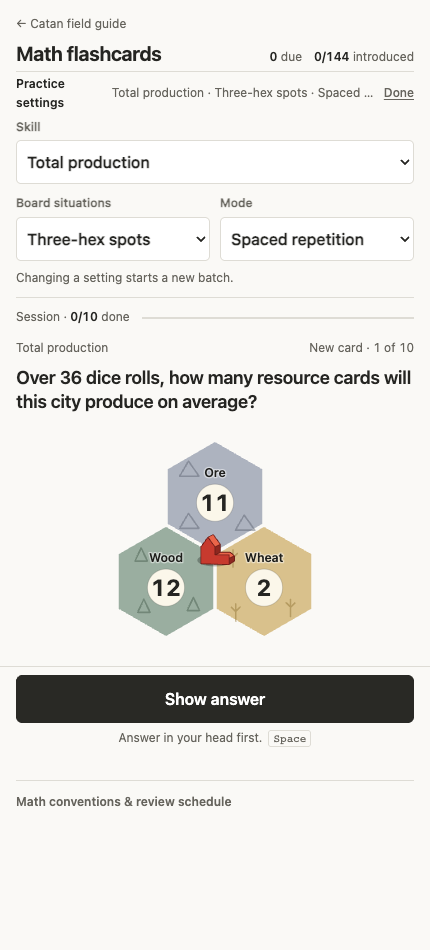
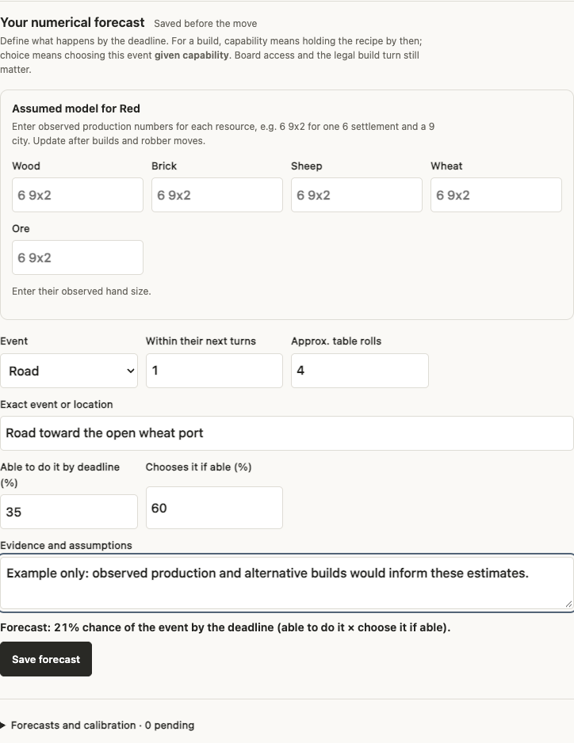
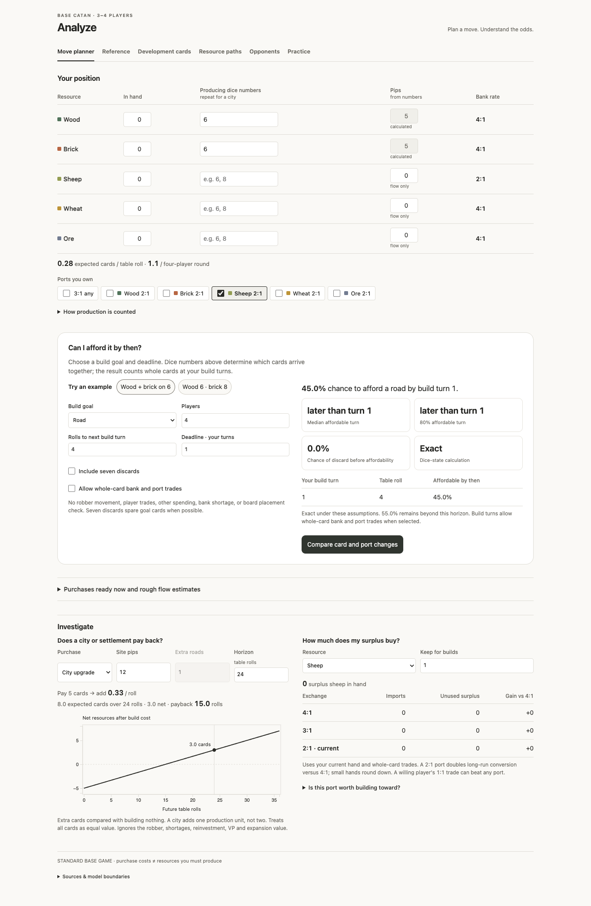

# Catan Trainer

An unofficial study and decision-practice project for CATAN players. It combines a probability guide, resource and opponent trackers, math drills, and an optional authenticated game with match replay.

## Try it

- **Hosted app:** [Open the Catan field guide](https://catan-field-guide.vercel.app/), then continue with Google. The hosted version has saved accounts, games, dashboards, match history, decision practice, and agent connections.
- **Standalone guide:** Clone this repository, run `npm run build`, then `npm start` and open `http://127.0.0.1:8768/`. This path needs Python 3 and Node.js; it stores guide inputs and flashcard progress in your browser. It does **not** include the authenticated game, account sync, replay, dashboard, or MCP services. You can also open the generated `index.html` and `flashcards.html` locally.

The Move planner estimates the chance that a hand and dice production can cover a chosen build by a build-turn deadline. The opponent tracker separates known cards from guesses and lets you lock numerical forecasts before recording an outcome. Math flashcards exercise dice, production, costs, and trades. In the hosted app, saved matches can be replayed from the player's view; decision practice compares selected legal plans across sampled, plausible hidden states. The playable match has one human seat and three optional agent seats: you bring and connect your own coding agents and keep their seat listeners running. No opponent agents are preconnected or hosted for you.

These are conditional models, not move recommendations or win-rate estimates. The planner states whether it uses exact dice-state calculation or sampled paths, reports uncertainty for sampled results, and does not model every robber move, player trade, spending choice, bank shortage, or board placement. Read the assumptions shown with each result before using it in a game.

## A look inside

| Standalone guide | Hosted account |
| --- | --- |
|  |  |
| Flashcards work in the local, account-free guide. | Forecasts are saved to a signed-in account. |

The planner is also available in the standalone guide. These screenshots use synthetic examples.

## Run your own hosted copy

See [Self-hosting](docs/SELF_HOSTING.md). You need your **own** Supabase project and hosted Node/Express deployment (the current deployment uses Vercel), Google sign-in configured in Supabase, and the repository migrations. Keep `SUPABASE_SECRET_KEY` on the server only. No keys, database, or player data are supplied in this repository.

The hosted sign-in currently accepts **any Google account**. It does not use an email allowlist. Each person's saved data is scoped to their account; a self-host operator should verify authentication, row-level security, and rate limits before inviting users. Connecting an AI agent to the account MCP grants broad access to that account's dashboards and complete game state, including hidden cards and the deck. A seat connection is limited to its assigned player; a sidekick connection is read-only. Review these scopes before connecting an agent.

## Source and rights

The project-authored code is offered under the [MIT License](LICENSE), subject to each contributor having the right to license their contribution. The adapted game engine retains the [Viral Doshi MIT notice](web/game/LICENSE). Bundled D3 and Vega-family notices are listed in [Third-party notices](THIRD_PARTY_NOTICES.md). The code license does not grant rights to CATAN trademarks, published artwork, text, or other third-party game material.

CATAN is a trademark of CATAN GmbH. This is an independent project and is not affiliated with or endorsed by CATAN GmbH or CATAN Studio. [CATAN's IP guidance](https://www.catan.com/guidelines-dealing-intellectual-property-catan) discusses commentary, derivative works, trademark use, and permission; no authorization from CATAN has been established for this full playable implementation. See [Licensing and publication scope](LICENSING.md) before redistributing a fork or using CATAN branding. No official artwork or reference screenshots should be added without rights to distribute them.

## Contribute and report issues

See [Contributing](CONTRIBUTING.md) for build/test workflow and provenance rules, and [Security](SECURITY.md) for private vulnerability reporting. The source templates are under `src/`; `build.py` generates the local pages. `web/build.mjs` generates the hosted page and browser bundles. Edit source, then rebuild; generated files are not authoritative.
